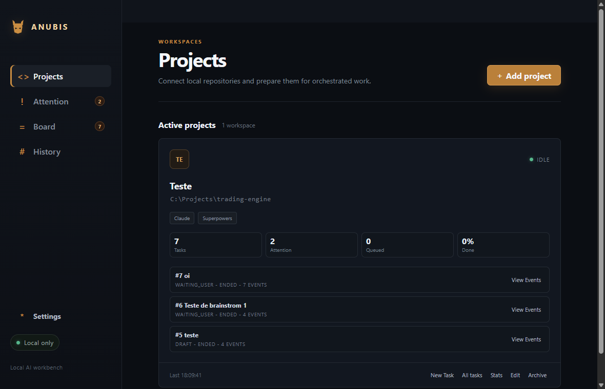
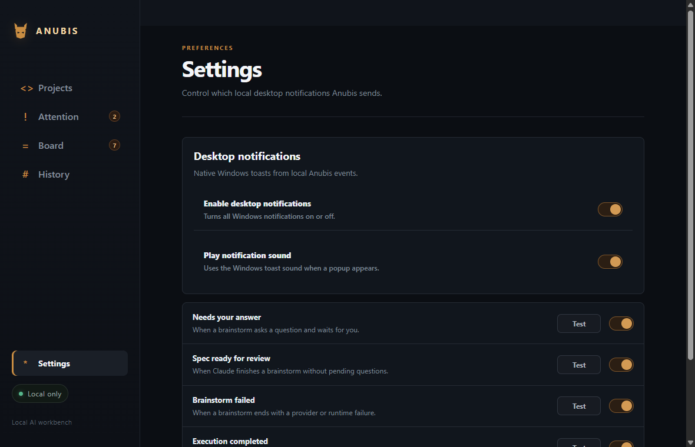

# Anubis

Anubis is a local desktop application for organizing, reviewing, and executing development tasks with AI agents. It connects local repositories, uses the Claude Agent SDK as the initial provider, and stores projects, tasks, specs, events, and settings in a local SQLite database.

The goal is to add a control layer around agent-driven development: guided brainstorms, user questions, spec approval, execution queues, history, full event inspection, project statistics, and native Windows notifications.

## Screenshots





## Features

- Local project registration with folder validation and a native path picker.
- Local SQLite persistence for projects, tasks, sessions, specs, events, and settings.
- Brainstorm flow powered by the Claude Agent SDK and the Superpowers workflow.
- Support for questions during brainstorm, answered from the Attention view.
- Markdown specs stored in the database, with review and approval before execution.
- Kanban board grouped by task state: draft, review, queued, running, done, and blocked.
- History for completed, failed, cancelled, and interrupted tasks.
- Per-project task browser for viewing every task in a workspace.
- Event viewer with complete responses, technical payloads, and expandable events.
- Project statistics, including total tasks, events, specs, queue, attention count, and completion rate.
- Native Windows notifications configurable by event type.
- Desktop notification sound setting.

## How It Works

1. Add a local project in **Projects**.
2. Create a task describing the work you want.
3. Anubis starts a brainstorm with Claude/Superpowers.
4. If the agent asks questions, they appear in **Attention**.
5. When the spec is ready, review and approve it.
6. The approved task enters the queue.
7. Run the task when you are ready.
8. Track events, history, board state, and project statistics inside the app.

Anubis does not replace Git, your editor, or your terminal. It organizes the agent workflow and keeps the decision trail local.

## Requirements

- Windows 10 or 11, 64-bit.
- Git for Windows.
- Node.js 22 or newer.
- npm 10 or newer.
- Claude installed and authenticated locally to use the Claude provider.

Check from a PowerShell session:

```powershell
git --version
node --version
npm --version
claude --version
```

## Development

Install dependencies and open the app:

```powershell
npm install
npm run dev
```

This compiles the Electron `main` and `preload` processes, starts the Vite renderer, and opens the Electron window.

## Validation

Run the full validation suite:

```powershell
npm run check
```

Or run each step separately:

```powershell
npm run typecheck
npm test
npm run build
```

## Claude Contract Test

The Claude contract test is opt-in because it opens a real session using your local Claude authentication.

```powershell
$env:ANUBIS_RUN_CLAUDE_CONTRACT = "1"
$env:ANUBIS_CLAUDE_EXECUTABLE = "$env:USERPROFILE\.local\bin\claude.exe"
npm run test:contract:claude
```

Regular `npm test` keeps this contract skipped.

## Local Data

The SQLite database is created in Electron's `userData` directory. On Windows, it is usually located at:

```text
%APPDATA%\anubis\anubis.db
```

Open the folder with:

```powershell
explorer $env:APPDATA\anubis
```

Close Anubis before editing, copying, or removing database files. During development, remove `anubis.db`, `anubis.db-wal`, and `anubis.db-shm` to reset local data.

## Notifications

Desktop notifications use the native Windows notification system. In **Settings**, you can enable or disable:

- desktop notifications;
- popup sound;
- alerts when a task needs an answer;
- alerts when a spec is ready for review;
- alerts when brainstorm fails;
- alerts when execution completes;
- alerts when execution fails.

Each notification type has a **Test** button.

Color, font, layout, and position for native popups are controlled by Windows. Fully custom visuals would require an in-app notification center inside Anubis.

## Scripts

| Command | Purpose |
|---|---|
| `npm run dev` | Open the Electron app in development |
| `npm run typecheck` | Validate TypeScript |
| `npm test` | Run unit and integration tests |
| `npm run build` | Generate the build in `out/` |
| `npm run preview` | Open the local build |
| `npm run check` | Run typecheck, tests, and build |

## Architecture

- `src/main`: privileged Electron process, SQLite, providers, services, and IPC handlers.
- `src/preload`: safe bridge between renderer and main.
- `src/renderer`: React interface.
- `src/shared`: serializable contracts shared between processes.
- `tests`: unit, integration, and Claude provider contract tests.

See [`docs/technical-design.md`](docs/technical-design.md) for architecture details and system invariants.
